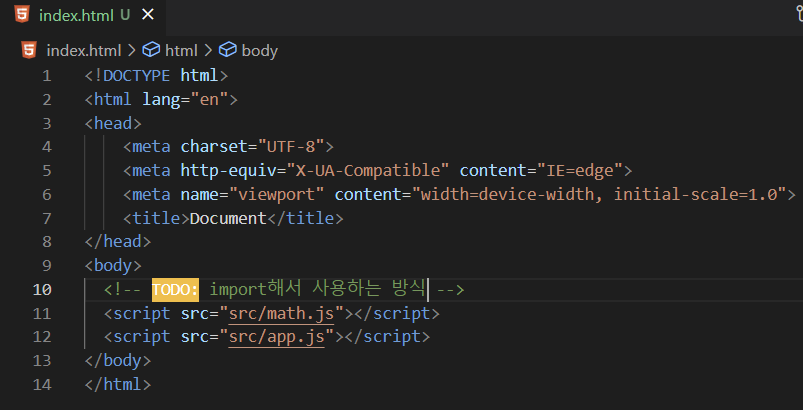

# 웹팩 (기본)

## 웹팩이 필요한 이유

> ES2015(ES6)부터 문법 수준에서 모듈을 지원하기 시작했다.
>
> 모듈을 지원했다 == import/export로 모듈을 사용했다!
>
> 그렇다면, 모듈을 지원하기 이전에는 어떻게 사용을 했을까..?

### [이전에 사용한 방법]

| 폴더구조                                                     | math.js                                                      | app.js                                                       |
| ------------------------------------------------------------ | ------------------------------------------------------------ | ------------------------------------------------------------ |
|  |  |  |

| index.html                                                   |
| ------------------------------------------------------------ |
|  |

* 문제가 발생한다. -> **전역스코프가 오염된다.**
* `math.js` 안에 있는 `sum 함수`는 이 파일 안에서만 유효한 것이 아니라, 어느 곳에서든 접근이 가능하다.
  * 
  * 이렇게 보는 것처럼, 전역인 `window`에 `sum 함수`가 등록되어 버린다.
  * js에서는 함수에 새로운 값을 할당할 수 있으므로, 전역에 등록된 함수가 오염이 되면 원하던 모듈을 그대로 사용할 수 없게 된다.
  * 

### [해결법 1] IIFE 모듈

* 즉시 실행 함수 표현(IIFE, Immediately Invoked Function Expression): 정의되자마자 즉시 실행되는 JS 함수를 의미한다.
* 이렇게 되면, 함수 안에 독립적인 scope가 생기게 된다. (전역스코프 문제를 피할 수 있다.)

| math.js                                                      | app.js                                                       |
| ------------------------------------------------------------ | ------------------------------------------------------------ |
|  |  |

* 이렇게 되면, `math`라는 namespace에서만 `sum 함수`를 접근할 수 있고, 전역에서는 접근할 수 없게 된다.
  * 