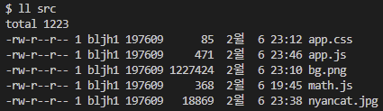

# 웹팩 (기본)

[toc]


## 1. 웹팩이 필요한 이유 (배경)

> ES2015(ES6)부터 문법 수준에서 모듈을 지원하기 시작했다.
>
> 모듈을 지원했다 == import/export로 모듈을 사용했다!
>
> 그렇다면, 모듈을 지원하기 이전에는 어떻게 사용을 했을까..?


### [이전에 사용한 방법]

| 폴더구조                                                     | math.js                                                      | app.js                                                       |
| ------------------------------------------------------------ | ------------------------------------------------------------ | ------------------------------------------------------------ |
|  |  |  |

| index.html                                                   |
| ------------------------------------------------------------ |
|  |

* 문제가 발생한다. -> **전역스코프가 오염된다.**
* `math.js` 안에 있는 `sum 함수`는 이 파일 안에서만 유효한 것이 아니라, 어느 곳에서든 접근이 가능하다.
  * 
  * 이렇게 보는 것처럼, 전역인 `window`에 `sum 함수`가 등록되어 버린다.
  * js에서는 함수에 새로운 값을 할당할 수 있으므로, 전역에 등록된 함수가 오염이 되면 원하던 모듈을 그대로 사용할 수 없게 된다.
  * 


### [해결법 1] IIFE 모듈

* 즉시 실행 함수 표현(IIFE, Immediately Invoked Function Expression): 정의되자마자 즉시 실행되는 JS 함수를 의미한다.
* 이렇게 되면, 함수 안에 독립적인 scope가 생기게 된다. (전역스코프 문제를 피할 수 있다.)

| math.js                                                      | app.js                                                       |
| ------------------------------------------------------------ | ------------------------------------------------------------ |
|  |  |

* 이렇게 되면, `math`라는 namespace에서만 `sum 함수`를 접근할 수 있고, 전역에서는 접근할 수 없게 된다.
  * 


### [해결법 2] 다양한 모듈 스펙

#### CommonJS

* JS를 사용하는 모든 환경에서 모듈을 사용하는 것이 목표이다.
* `exports` 키워드로 모듈을 만들고, `require()` 함수로 불러 들이는 방식
* 대표적으로 서버 사이드 플랫폼인 <u>Node.js에서 이를 사용한다</u>.
* 

#### AMD(Asynchronous Module Definition)

* 비동기로 로딩되는 환경에서 모듈을 사용하는 것이 목표이다.
* 주로 브라우저 환경

#### UMB(Universal Module Definition) 

* AMD 기반으로 CommonJS 방식까지 지원하는 통합 형태


### [해결법 3] 표준 모듈 시스템 (ES2015)

* 지금은 바벨과 웹팩을 사용해서 이 모듈 시스템을 사용하는 것이 일반적이다.
* `export` 구문으로 모듈을 만들고, `import`구문으로 가져와 사용할 수 있다.

| math.js                                                      | app.js                                                       |
| ------------------------------------------------------------ | ------------------------------------------------------------ |
|  |  |

| index.html                                                   |
| ------------------------------------------------------------ |
|  |

* `script`태그에서 `app.js`만 가져오면 사용할 수 있고, `type="module"`이라는 어트리뷰트를 입력해주면 된다.

* 그러나 이것을 브라우저에서 오픈해보면 CORS 에러가 난다.

* 

  * 브라우저가 바로 파일을 읽지 못해서 생기므로, 서버를 돌려야 한다.

  * `lite-server`라는 간단한 node 서버를 돌려보자! 그러면 똑같이 `3`이라는 결과를 얻을 수 있다.

    ```bash
    $ npx lite-server
    ```

    

**브라우저에서 모두 모듈을 사용할 수 있는게 아니므로, 이를 사용하게 해주는 장치가 필요한데 그것이 바로 웹팩이다!!!!!!!**


## 2. 엔트리/아웃풋


> 위처럼 모듈로 파일을 작성하게 되면, 왼쪽처럼 여러 파일이 존재하고 서로 의존해있는 형태를 띄게 된다.

* 웹팩: 여러개의 파일을 하나의 파일로 합쳐주는 번들러(bundler)
  의존관계에 있는 여러개의 파일들을 하나로 합쳐준다!!!!!
  * 이렇게 하나로 합쳐진 파일을 **번들(bundle)**이라고 한다. (번들을 만들어줘서 번들러)


### 웹팩 설치하기

* 번들 작업을 하는 웹팩 패키지와 웹팩 터미널 도구를 설치한다.

* ```bash
  $ npm i webpack webpack-cli --save-dev
  ```

  * 이렇게 설치를 하면 `--save-dev` 옵션 때문에 `package.json`에서 `devDependencies`에 버전이 작성되게 된다.
  * 

  * 이것은 개발용 패키지라고 보면 된다!

* 설치를 완료하면, `node_modules/.bin/` 폴더에 `webpack`과 `webpack-cli`가 생성된다. 이걸로 웹팩을 터미널에서 실행할 수 있다. 

> `.bin` 폴더의 정체
>
> * 바이너리 파일들이 저장되는 곳 (바이너리 파일이란, 0과 1로만 이루어진 파일)
> * `npm install`로 모듈를 설치하고 나면 발생하는 일
>   1. 모듈이 `node_modules/{패키지명}` 폴더에 설치된다.
>   2. 모듈을 바이너리로 컴파일한다.
>   3. 컴파일된 바이너리 파일을 `node_modules/.bin`에 복사한다.
> * 설치한 모듈을 사용하기 위해서는 두가지 방법이 사용될 수 있다.
>   1. node 명령어 사용
>   2. npm script 사용:  `.bin` 폴더에 들어있는 실행파일을 직접 실행하는 것이다.


* webpack을 실행할 때에는 필수적인 옵션이 3개 있다.
  1. `--mode`
  2.  `--entry`: 모듈의 시작점을 의미한다.
  3.  `--output`: 모든 모듈을 하나로 합치고 저장하는 경로를 설정하는 곳이다.

* 명령어에 직접 입력할 수 있지만, 매번 명령어로 실행할 수 없으므로, 설정파일을 사용한다

  * `webpack.config.js`

  * ```javascript
    const path = require("path");
    
    module.exports = {
      mode: "development",
      entry: {
        main: "./src/app.js",
      },
      output: {
        path: path.resolve("./dist"),
        filename: "[name].js",
      },
    };
    ```

    > 여기에 있는 `module`은 ES6가 아닌, node.js에서 제공하는 모듈이다!

    * `entry`: 객체를 전달하고, 이때 `main`이라는 키에 엔트리포인트의 경로를 입력한다.
    * `output`: 객체를 전달하고 그 안에 두개의 키로 필요한 내용을 입력한다.
      `path`는 output dir명을 입력하는 것이고, 절대경로를 입력한다. node.js의 path 모듈을 가져와서 절대경로를 지정해준다.
      `filename` 번들링된 파일의 이름이 된다. `[name].js`라고 작성한 것은 entry에서 설정한 키 값인 `main`으로 치환될 것이다! 이렇게 사용하면, 여러 엔트리를 가졌을 때 동적으로 output 파일의 이름을 설정해준다.


### 웹팩으로 코드를 번들링하는 과정을, npm script에 등록하는 법

* `package.json`을 아래와 같이 변경한다.

```json
{
  ...,
  "scripts": {
    "build": "webpack"
  },
  ...
}

```

> node_modules/.bin 경로는 생략해도 괜찮다. 이를 제외한 실행파일명을 알맞게 작성해주자!


## 2-1. 엔트리와 아웃풋 [실습]

npm으로 프로젝트를 셋팅하고, webpack을 셋팅하고, entry와 아웃풋을 설정하고 나면 빌드된 파일이 생기는데, TODO에 빌드한 js 파일을 로딩하는 실습을 해보자!


## 3. 로더

* JS는 모든 파일을 모듈로 바라본다. css, image, font 등을 모두 모듈로 보기 때문에 ES6의 `import` 구문을 사용하여 가져올 수 있다.
* 이것이 가능한 이유가 **Loader** 때문이다.

* 로더를 사용하려면 webpack.config.js의 `module` 객체에 추가해주면 된다.

```javascript
module.exports = {
  ...
  module: {
    // 이 배열 안에 객체로 로더를 넘겨준다!  
    // 객체는 test와 use라는 키를 가진 객체이다.  
    rules: [
      {
        test: "",
        use: "",
      },
    ],
  },
};

```

* `test`: 로더가 처리해야 할 파일의 패턴(정규표현식)을 입력한다.
* `use`: 사용되는 로더를 입력한다.


## 3-1. 자주 사용하는 로더

### css-loader

* 설치하기

```bash
$ npm install css-loader --save-dev
```

> 버전에 매우 민감! 호환되는지를 확인하고 설치


* webpack.config 설정 방법

```javascript
module.exports = {
  module: {
    rules: [
      {
        test: /\.css$/, // .css 확장자로 끝나는 모든 파일
        use: ["css-loader"], // css-loader를 적용한다
      },
    ],
  },
}
```


### style-loader

* 설치하기

```bash
$ npm install style-loader --save-dev
```

* 모듈로 변경된 스타일시트는 돔에 추가되어야만 브라우저가 해석할 수 있다.
* `css-loader`만 사용하면 js 코드로만 변경되었을 뿐, DOM에 적용되지 않았기 때문에 스타일이 적용되지 않는다.
* `style-loader`는 js로 변경된 스타일을 동적으로 돔에 추가하는 로더, css를 번들링하기 위해서는 이 두 로더를 함께 사용해야 한다.


* webpack.config 설정 방법

```javascript
module.exports = {
  module: {
    rules: [
      {
        test: /\.css$/,
        use: ["style-loader", "css-loader"], // style-loader를 앞에 추가한다
      },
    ],
  },
}
```

> loader를 읽는 순서가 뒤에서부터 앞이므로, css-loader를 styled-loader보다 뒤에 적는다!


### file-loader

* CSS뿐만 아니라 소스코드에서 사용하는 모든 파일을 모듈로 사용하게끔 할 수 있따. 
* `file-loader`: 파일을 모듈 형태로 지원하고 웹팩 아웃풋에 파일을 옮겨주는 것

* 설치하기

```bash
$ npm install file-loader --save-dev
```


* 예시) 이미지 파일을 배경으로 넣고 싶다면

* style.css

```css
body {
    background-image: url(bg.png)
}
```

* 그리고 `npm run build`를 실행하면, 다음과 같은 에러메시지가 나온다.


> Module parsing에서 에러가 났다. css-loader가 구문에서 `bg.png`를 불러오는데 이것을 불러올 수 없다는 에러


* webpack.config 설정 방법

```javascript
module.exports = {
  module: {
    rules: [
      {
        test: /\.png$/, // .png 확장자로 마치는 모든 파일
        loader: "file-loader", // 파일 로더를 적용한다
      },
    ],
  },
}
```

* 웹팩이 .png파일을 인식해서 file-loader를 실행한다
* 로더가 동작하고 나면 output 경로에 이미지 파일이 복사되고, 파일명이 해시값으로 변경된다.
  * 캐시 갱신을 위해서 처리한 것을 보임
  * 정적파일은 브라우저에서 성능을 위해서 캐싱을 하고 있는데, 파일 내용이 달라지고 이름이 같으면 이전에 저장했던 캐시 내용을 사용한다.
  * 그래서 이를 예방하는 것이 이름을 해시로 변경해버리는 것이다.
* 그런데, `index.html`을 실행해서 확인해보면 **이미지가 뜨지 않는다!!!!**


* why? 브라우저에서 실행된 `index.html`을 보면 알 수 있다.


* `url()` 내에 작성했던 파일의 이름이 변경되어 있다.
  * 그런데 이 파일은 `src`폴더가 아닌, `dist`폴더에 있다. 그러므로, `src`에서 부르려는 현재의 동작에서는 파일을 찾을 수 없다는 에러를 반출하는 것이다.
* 그렇다면, 이를 해결하기 위해 변경을 해보자!!!


* webpack.config.js 설정 방법

```javascript
module: {
    rules: [
      {
        test: /\.png$/,
        // use: ['file-loader'], 원래 있던 형태는 지우고 아래를 입력한다.
        loader: 'file-loader',
        options: {
          publicPath: './dist/',
          name: '[name].[ext]?[hash]'
        }
      },
    ],
  },
```

> `loader`의 `options`는 그 로더의 옵션을 지정할 수 있다.
>
> * `publicPath`는 파일로더가 처리하는 파일을 모듈로 사용했을 때, 경로부분 앞에 추가되는 문자열이다! 
>   * 우리가 설정한 output 경로와 동일하게 설정을 하면 된다.
> * `name`은 파일로더가 output에 복사를 할때 만드는 파일이름의 형태를 지정한다.
>   * 현재 작성된 형태는, `원본파일명`.`확장자`?`해시`를 해서 우리가 알아보면서도 캐싱에서의 문제점도 해결하게 했다!

* 그러면 이렇게 해결이 되어있다!!!


### url-loader

* 사용하는 이미지 갯수가 많다면 네트워크 부담이 많아지고 사이트 성능에도 영향을 줄 수 있다.
* 만약... 한 페이지에서 작은 이미지를 여러개 사용한다며 **[Data URI Scheme](https://en.wikipedia.org/wiki/Data_URI_scheme)**을 사용하는 것이 더 낫다
  * 
  * 이미지 태그를 쓸 때 src에 경로가 아닌 문자열을 넣을 수 있는데, data 포맷을 지정하고 인코딩 방식을 지정한 후 그 값을 넣어주면 이미지로 렌더링한다!
  * 그래서 작은 파일은 이렇게 바로 html로 넣어주는 것이 효율적이다. (주소를 쓰면 네트워크 통신을 하는데, 이런 방식은 통신을 하지 않기 때문!!!!!!!!!)
* `url-loader`가 이처럼 base64로 인코딩하여 문자열 형태로 소스코드에 넣어주는 것을 자동화하는 로더이다!!!

* 설치하기

```bash
$ npm install url-loader --save-dev
```


* 예시) 사이즈가 작은 jpg 파일을 가져와서 사용해보자

* app.js


> nyancat을 모듈로 만들어서 import를 했다.
>
> DOM이 만들어졌을 때 이미지 태그를 추가하는데, 이 때 이미지는 import한 nyancat이다.


* jpg 파일은 기본적으로 `file-loader`가 처리할 수 있다.
* webpack.config.js 설정 방법

```javascript
  module: {
    rules: [
      ...
      {
        test: /\.(png|jpg|gif|svg)$/,  // 대표적인 네가지 이미지 파일을 넣는다.
        loader: 'file-loader',
        options: {
          publicPath: './dist/',
          name: '[name].[ext]?[hash]',
        },
      },
    ],
  },
```

* 이렇게 실행하면 `dist/`폴더에 `nyancat.jpg`도 잘 들어가 있고, `index.html`에도 잘 나타나는 것을 확인할 수 있다.


* 그러면, nyancat.jpg의 이미지 크기를 확인해보자
* 

> `ll`이라는 명령어란, ls 란 해당 디렉토리에 존재하는 파일목록을 표시해주며, **ll** 이란 **ls 명령어에 -l 옵션을 준 형태**이다. (참고로, -l 옵션은 long 옵션으로 상세히 출력하라는 의미이다.)	

* 18kb로 매우 작은 크기이다. 이런것들은 dist로 옮길 필요없이 base64로 바로 넣어버린다.!!!!	


* webpack.config.js 설정 방법

```javascript
  module: {
    rules: [
      { test: /\.css$/, use: ['style-loader', 'css-loader'] },
      {
        test: /\.(png|jpg|gif|svg)$/,
        loader: 'url-loader',  // file-loader -> url-loader
        options: {
          publicPath: './dist/',
          name: '[name].[ext]?[hash]',
          limit: 20000, 
          // 20kb, url-loader가 20kb미만 크기의 파일들만 처리를 하고 그 외는 file-loader가 실행된다.
        },

      },
    ],
  },
```

* `dist/` 폴더를 날린 후, 다시 `npm run build`를 한다. 그리고 `dist/main.js`를 확인해보면..


* 이렇게 base64파일로 변경이 된 것을 알 수 있다!!
