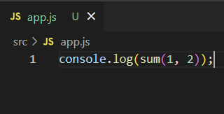

# 웹팩 (기본)

## 웹팩이 필요한 이유 (배경)

> ES2015(ES6)부터 문법 수준에서 모듈을 지원하기 시작했다.
>
> 모듈을 지원했다 == import/export로 모듈을 사용했다!
>
> 그렇다면, 모듈을 지원하기 이전에는 어떻게 사용을 했을까..?


### [이전에 사용한 방법]

| 폴더구조                                                     | math.js                                                      | app.js                                                       |
| ------------------------------------------------------------ | ------------------------------------------------------------ | ------------------------------------------------------------ |
|  |  |  |

| index.html                                                   |
| ------------------------------------------------------------ |
|  |

* 문제가 발생한다. -> **전역스코프가 오염된다.**
* `math.js` 안에 있는 `sum 함수`는 이 파일 안에서만 유효한 것이 아니라, 어느 곳에서든 접근이 가능하다.
  * 
  * 이렇게 보는 것처럼, 전역인 `window`에 `sum 함수`가 등록되어 버린다.
  * js에서는 함수에 새로운 값을 할당할 수 있으므로, 전역에 등록된 함수가 오염이 되면 원하던 모듈을 그대로 사용할 수 없게 된다.
  * 


### [해결법 1] IIFE 모듈

* 즉시 실행 함수 표현(IIFE, Immediately Invoked Function Expression): 정의되자마자 즉시 실행되는 JS 함수를 의미한다.
* 이렇게 되면, 함수 안에 독립적인 scope가 생기게 된다. (전역스코프 문제를 피할 수 있다.)

| math.js                                                      | app.js                                                       |
| ------------------------------------------------------------ | ------------------------------------------------------------ |
|  |  |

* 이렇게 되면, `math`라는 namespace에서만 `sum 함수`를 접근할 수 있고, 전역에서는 접근할 수 없게 된다.
  * 


### [해결법 2] 다양한 모듈 스펙

#### CommonJS

* JS를 사용하는 모든 환경에서 모듈을 사용하는 것이 목표이다.
* `exports` 키워드로 모듈을 만들고, `require()` 함수로 불러 들이는 방식
* 대표적으로 서버 사이드 플랫폼인 <u>Node.js에서 이를 사용한다</u>.
* 

#### AMD(Asynchronous Module Definition)

* 비동기로 로딩되는 환경에서 모듈을 사용하는 것이 목표이다.
* 주로 브라우저 환경

#### UMB(Universal Module Definition) 

* AMD 기반으로 CommonJS 방식까지 지원하는 통합 형태


### [해결법 3] 표준 모듈 시스템 (ES2015)

* 지금은 바벨과 웹팩을 사용해서 이 모듈 시스템을 사용하는 것이 일반적이다.
* `export` 구문으로 모듈을 만들고, `import`구문으로 가져와 사용할 수 있다.

| math.js                                                      | app.js                                                       |
| ------------------------------------------------------------ | ------------------------------------------------------------ |
|  |  |

| index.html                                                   |
| ------------------------------------------------------------ |
|  |

* `script`태그에서 `app.js`만 가져오면 사용할 수 있고, `type="module"`이라는 어트리뷰트를 입력해주면 된다.

* 그러나 이것을 브라우저에서 오픈해보면 CORS 에러가 난다.

* 

  * 브라우저가 바로 파일을 읽지 못해서 생기므로, 서버를 돌려야 한다.

  * `lite-server`라는 간단한 node 서버를 돌려보자! 그러면 똑같이 `3`이라는 결과를 얻을 수 있다.

    ```bash
    $ npx lite-server
    ```

    

**브라우저에서 모두 모듈을 사용할 수 있는게 아니므로, 이를 사용하게 해주는 장치가 필요한데 그것이 바로 웹팩이다!!!!!!!**


## 엔트리/아웃풋


> 위처럼 모듈로 파일을 작성하게 되면, 왼쪽처럼 여러 파일이 존재하고 서로 의존해있는 형태를 띄게 된다.

* 웹팩: 여러개의 파일을 하나의 파일로 합쳐주는 번들러(bundler)
  의존관계에 있는 여러개의 파일들을 하나로 합쳐준다!!!!!
  * 이렇게 하나로 합쳐진 파일을 **번들(bundle)**이라고 한다. (번들을 만들어줘서 번들러)


### 웹팩 설치하기

* 번들 작업을 하는 웹팩 패키지와 웹팩 터미널 도구를 설치한다.

* ```bash
  $ npm i -D webpack@4 webpack-cli --legacy-peer-deps
  ```

  * 이렇게 설치를 하면 `-D` 옵션 때문에 `package.json`에서 `devDependencies`에 버전이 작성되게 된다.
  * 

  * 이것은 개발용 패키지라고 보면 된다!

* 설치를 완료하면, `node_modules/.bin/` 폴더에 `webpack`과 `webpack-cli`가 생성된다. 이걸로 웹팩을 터미널에서 실행할 수 있다. 

> `.bin` 폴더의 정체
>
> * 바이너리 파일들이 저장되는 곳 (바이너리 파일이란, 0과 1로만 이루어진 파일)
> * `npm install`로 모듈를 설치하고 나면 발생하는 일
>   1. 모듈이 `node_modules/{패키지명}` 폴더에 설치된다.
>   2. 모듈을 바이너리로 컴파일한다.
>   3. 컴파일된 바이너리 파일을 `node_modules/.bin`에 복사한다.
> * 설치한 모듈을 사용하기 위해서는 두가지 방법이 사용될 수 있다.
>   1. node 명령어 사용
>   2. npm script 사용:  `.bin` 폴더에 들어있는 실행파일을 직접 실행하는 것이다.


## 웹팩 주요 개념 ([공식문서 Concepts](https://v4.webpack.js.org/concepts/))

> 웹팩은 static module bundler이고, 웹팩이 프로젝트를 처리할 때 내부적으로 dependency graph를 생성한다. 그리고 이 dependency graph에서 프로젝트 내의 모든 모듈을 연결하고, 번들을 생성한다.
>
> 웹팩 4.0.0 버전 이후로 번들에 configuration file을 필요로 하지 않지만, 개인의 니즈에 맞게 설정이 가능하다.


### 1. Entry

* **Entry point**는 내부 dependency graph 빌딩을 시작할 때 사용되는 모듈을 의미한다. 웹팩은 이후 엔트리 포인트와 직/간접적으로 의존되어 있는 모듈과 라이브러리를 찾아나간다. 
* default로는 `./src/index.js`를 엔트리 포인트로 사용한다. 하지만 웹팩 config에서 다른 파일이나 멀티 엔트리 포인트를 설정할 수 있다.


**Entry point 설정 방법: webpack.config.js**

```js
module.exports = {
  entry: './path/to/my/entry/file.js'
};
```


### 2. Output

* **Output** 속성은, 생성된 번들들을 어디르 emit할지 그리고 어떻게 이 파일(번들)을 명명할지를 설정하는 것이다. 
* default로는 `./dist/main.js`가 메인 output file이 되고, `./dist` 폴더에 다른 생성된 파일들이 위치하게 된다.
* 웹팩 config의 `output` 필드에서 이 설정을 변경할 수 있다.


**Output 설정 방법: webpack.config.js**

```javascript
const path = require('path');

module.exports = {
  entry: './path/to/my/entry/file.js',
  output: {
    path: path.resolve(__dirname, 'dist'),
    filename: 'my-first-webpack.bundle.js'
  }
};
```

> 이 예시에서,  `output.filename`과 `output.path`속성 사용해서 웹팩이 번들의 이름과 어디로 위치시키면 좋을지를 알려준다. 
>
> 최상단에 위치한 `path` 모듈은, 코어 Node.js 모듈로 파일 경로를 조작하는데에 사용된다. 


### 3. Loaders

* 웹팩은 JS 혹은 JSON 파일만 이해할 수 있다. 
* **Loader**는 웹팩이 다른 종류의 파일을 처리하고, 그것들을 유효한 모듈로 변경할 수 있게 하여, 의존성 그래프에 추가한다.

> 어떤 종류의 모듈이든 `import`를 사용할 수 있는 것은 웹팩의 특징인 것이고, 다른 번들러나 태스크러너에서는 지원되지 않을 수 있다.

* `Loader`는 웹팩 config에서 두개의 속성을 가지고 있다.
  1. `test`: 어떤 파일(들)이 변형될 것인지를 확인한다.
  2. `use`: 변형 과정에 어떤 로더를 사용할 것인지를 명시한다.


**Loader 설정 방법: webpack.config.js**

```javascript
const path = require('path');

module.exports = {
  output: {
    filename: 'my-first-webpack.bundle.js'
  },
  module: {
    rules: [
      { test: /\.txt$/, use: 'raw-loader' }
    ]
  }
};
```

>  위 설정해서는 `rules` 속성을 정의했다. (이 속성에는 `test`와 `use`라는 두 속성이 더 필요하다) 위 코드는 아래와 같은 의미를 갖는다.
>
> "웹팩 컴파일러야, '.txt' 파일을  `require()`/`import` 구문에 포함하고 있는 경로를 발견한다면, `raw-loader`를 사용해서 번들에 추가되기 전에 변형해주렴."

* 주의 사항
  * `module.rules`에서 설정하는 것이다!
  * regex를 사용해 매칭되는 파일을 찾는 것이라면, 인용을 하면 안된다. 
    * `/\.txt$/` *is not the same as* `'/\.txt$/'` *or* `"/\.txt$/"`
    * 전자는 .txt로 끝나는 어떤 파일이든  웹팩에게 지시하는 것이라면, 후자들은 웹팩에게 절대 경로로 '.txt'인 파일 하나를 의미하는 것이다.  
  * *추가적인 cumstomization은 loaders 설정 검색해보기*


### 4. Plugins

* loader는 모듈의 특정 타입을 변환하는 데에 사용된다면, **Plugin**은 번들 최적화, 애셋 관리, 환경 변수 주입 등의 넓은 범위의 업무를 수행하는 데에 사용될 수 있다.
* plugin을 사용하기 위해서는, `require()` 함수로 플러그인을 부르고, `plugins`라는 array에 넣어줘야 한다. 
* 대부분의 plugin은 옵션을 통해 커스텀할 수 있고, config에서 다른 목적으로 여러번 plugin을 사용할 수 있으므로, `new` 생성자를 통해 새로운 객체로 생성해 놓는 것이 좋다.


**Plugins 설정 방법: webpack.config.js**

```javascript
const HtmlWebpackPlugin = require('html-webpack-plugin'); //installed via npm
const webpack = require('webpack'); //to access built-in plugins

module.exports = {
  module: {
    rules: [
      { test: /\.txt$/, use: 'raw-loader' }
    ]
  },
  plugins: [
    new HtmlWebpackPlugin({template: './src/index.html'})
  ]
};
```

> 위 예시에서, `html-webpack-plugin`은 모든 생성된 번들을 자동적으로 주입시킴으로써 프로젝트에 HTML 파일을 생성한다. 

* plugin을 사용하는 것은 직관적이다. 하지만 좀 더 알아봐야 하는 용례가 많으니, 더 알아봐라!


### 5. Mode

* **Mode**를 `development`, `production` or `none`로 설정함으로써, 각각의 환경에 맞는 웹팩의 내장 최적화를 사용할 수 있다. 
* default는 `production`이다.

```javascript
module.exports = {
  mode: 'production'
};
```


### 6. Browser Compatibility

웹팩은 ES5+를 지원하는 모든 브라우저에서 지원된다. 웹팩은 `import()`와 `require.ensure()`를 위해  `Promise`를 필요로 한다. 더 오래된 브라우저에서 지원하길 원한다면, polyfill을 로드해야 한다.


## 웹팩 시작하기 ([공식문서 Getting Started](https://v4.webpack.js.org/guides/getting-started/))